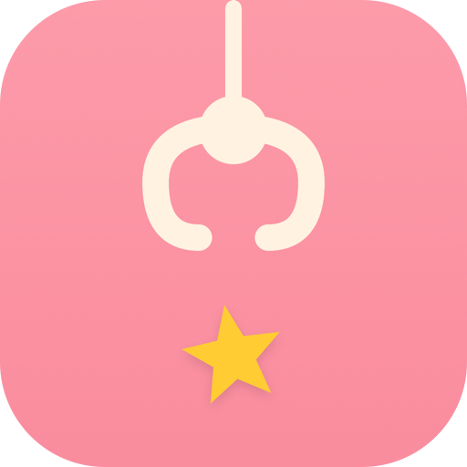
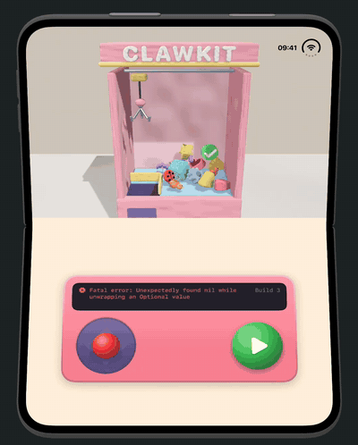
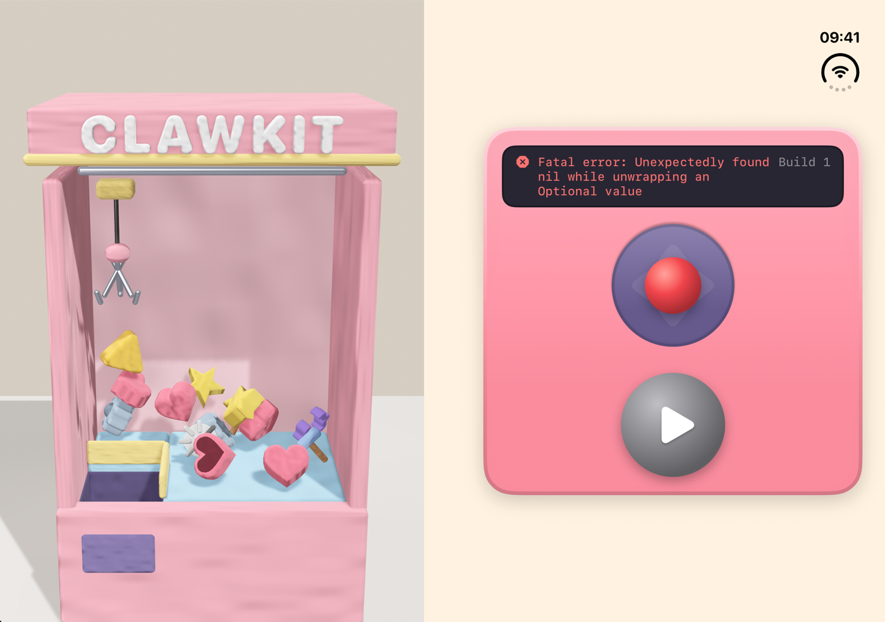

<p align="center">
  
</p>

<h1 align="center">ClawKit</h1>

<p align="center">
  A clay claw machine for the foldable <b>iPhone Duo</b>. The machine sits above the fold and the controls below it. Every prize is something from an iOS developer's day.
</p>

<p align="center">
  
  
  
  
  <a href="LICENSE"></a>
</p>

<p align="center">
  <a href=".github/images/demo.mp4"></a>
</p>

## How to Play

Half-fold the device and stand it on a table like a small laptop. Now it's an arcade cabinet.

- **Joystick** moves the claw. **Run** (▶) drops it. Every run is a new build.
- A miss prints `Fatal error: Unexpectedly found nil`. A prize that slips out of the claw prints `EXC_BAD_ACCESS`. A win is `Merged to main 🎉`.
- The **bug** crawls away from the claw. It's a bug, after all.
- **Fold or unfold quickly** to shake the machine: Clean Build Folder.
- **Close the device** to see your shelf on the outer display.

In book pose, the machine and the controls sit side by side:

<p align="center">
  
</p>

## Prizes

| Rarity | Prizes |
| --- | --- |
| Common | Star, Heart, Curly Braces, Warning, Gear |
| Rare | Bug, Hammer, Spinner, `@State` |
| Epic | Bird, Simulator |
| Legendary | Build Succeeded, Approved, Tiny Duo |

Rarer prizes show up less often and slip out of the claw more often.

## Under the Hood

- The **division region** (`GeometryProxy.reservedRegions(kind: .division, options: .includeInactive)`) is the layout. [`ClawKitView`](ClawKit/App/ClawKitView.swift) puts the machine on one side of the fold and the controls on the other: above and below it in tabletop pose, side by side in book pose. A flat device splits along the inactive fold, too.
- [`onHingeChange`](ClawKit/App/ClawKitView.swift) drives interactions, as Apple recommends: the shelf when the device is closed, and a shake when the hinge angle jumps.
- The machine is a single `RealityView` that survives layout changes. The scene is built once in [`MachineScene`](ClawKit/Scene/MachineScene.swift), so folding never resets it.
- There are no 3D assets. [`PrizeModels`](ClawKit/Scene/PrizeModels.swift) sculpts every prize from primitives, extruded SwiftUI `Path`s (`MeshResource(extruding:)`), and extruded text.
- [`Plasticine`](ClawKit/Scene/Plasticine.swift) is a matte `PhysicallyBasedMaterial` with a generated normal map, so the clay shows fingerprints.
- Prizes are RealityKit rigid bodies. [`ClawGame`](ClawKit/Game/ClawGame.swift) moves the kinematic claw on every `SceneEvents.Update`, and a grabbed prize rides along as a child of the claw.

## Requirements

- Xcode 27.1+
- iOS 27.1+ SDK
- iPhone Duo simulator or device for the fold. On other devices, the controls sit under the machine.

## Building

```bash
xcodebuild -project ClawKit.xcodeproj -scheme ClawKit \
  -destination 'platform=iOS Simulator,name=iPhone Duo' build
```

To record a demo, launch with `-autoplay`, and the machine plays by itself:

```bash
xcrun simctl launch booted com.artemnovichkov.ClawKit -autoplay
```

## Project Structure

```
ClawKit
├── App        # App entry point and the layout around the fold
├── Game       # Game rules, prizes, and the shelf
├── Scene      # RealityKit scene, prize models, and the clay material
├── Controls   # Joystick, Run button, and console
├── Shelf      # Your prizes, on the outer display
└── Resources  # Asset catalog
```

The Xcode project uses Xcode's JSON project format ([`project.xcproj`](ClawKit.xcodeproj/project.xcproj)). Each source file is listed there with its target membership.

## See Also

- [iPhone Duo by Examples](https://github.com/artemnovichkov/iPhone-Duo-by-Examples): runnable examples of the iPhone Duo APIs.
- [Accorduon](https://github.com/artemnovichkov/Accorduon): an accordion for iPhone Duo where the hinge is the bellows.
- [Duogami](https://github.com/artemnovichkov/Duogami): an origami workshop for iPhone Duo.
- [SandValley](https://github.com/artemnovichkov/SandValley): sand that slides into the fold of iPhone Duo.

## Author

Artem Novichkov, https://artemnovichkov.com/

## License

The project is available under the MIT license. See the [LICENSE](./LICENSE) file for more info.
